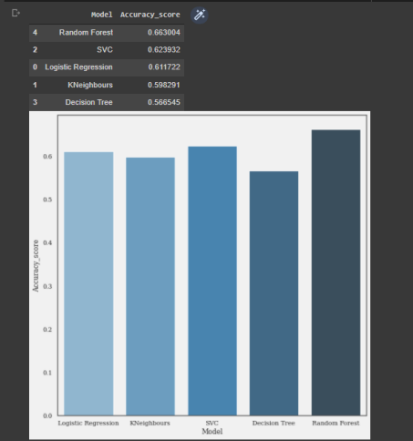

#  <h1 align="center">:droplet: Potability-of-Water :droplet:

## Machine Learning Project

### I would like to talk about our Machine Learning project called "Potability of Water" that we did with my friend [Elif Bayır](https://github.com/elifbayirr). Access to safe drinking water is essential for health. With the help of some measurable properties of water, we tried to predict the drinkability of water, namely its quality, using data from 3,276 different water bodies.We are also delighted that our project has been supported by Associate Professor Femilda Josephin J S to expand it into a research paper.
You can find the details of our project here:

:droplet::droplet::droplet:

